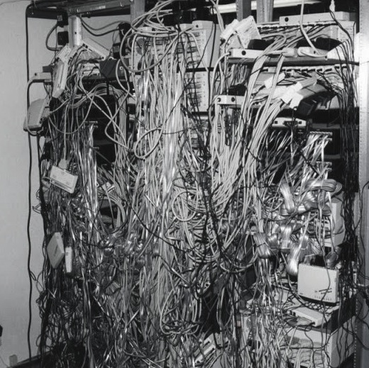

# 正在為大數據所苦嗎？帶你了解 Kafka 這個分布式消息串流平台，以及它能解決什麼問題！

如果推出的 Web 系統受到市場親睞，那隨著使用者成長，勢必會更高頻率的呼叫 api 與存取資料庫；假使我們沒有設計任何的緩衝機制，那資料庫不堪重負也只是時間問題。

而且隨著公司規模的擴張，接下來可能會有專門的團隊來分析使用者行為，公司高層與投資人會想看具體的業務狀況，需要建立即時監控系統，甚至會需要整合外部資源...然後系統架構就會變成下面這張圖。


> image from [link](https://engineering.linkedin.com/distributed-systems/log-what-every-software-engineer-should-know-about-real-time-datas-unifying)

如果你覺得這個畫面很可怕，那不妨花點時間了解 Kafka 這門技術；本篇文章會帶讀者了解他的精神，以及程式的具體實踐方式。

```
大綱

一、Kafka 具體能解決哪些問題，為什麼能解決？
二、Kafka 的基礎架構與階層關係
三、Kafka 為什麼吞吐量大？
四、Redis 也能夠處理 Pub/Sub，為什麼要用 Kafka？
五、手把手帶你建立 Node.js 專案 ＆ Kafka 環境
六、啟動專案，了解 Kafka 的運行邏輯
```

> 本篇是參考了許多大神的文章，再用自己的話語表達出來，筆者將相關資源放在最下方，有興趣的讀者可以參考看看。

### 一、Kafka 具體能解決哪些問題，為什麼能解決？

*Kafka 可以讓資料以合適的時機出現在合適的地方，你可以把它想像成消息隊列（Message queue），生產者（Producer）會往隊列結尾塞東西，消費者（Consumer）從隊列依次拿東西。*

可能看完上面的解釋大家還是一頭霧水，下面就用「送包裹」的概念來跟大家講解吧。

#### 困境描述：
如果住在沒有管理員的公寓，包裹在上班時間送到你家門口，你就只能跟貨運司機說聲抱歉，因為沒人在家只能請他下次再送。
#### 解決方案：
因為不是每個人都住在有管理員幫忙收包裹的大樓，為了解決這個問題，市場提出一個解決方案：「超商取貨」；從此以後，貨運司機不用跟你聯繫，把包裹送到超商就完事，而你也不用在家裡等司機送貨，自己有時間的時候再去取貨就好。

「Kafka」就是扮演上述解法中的「超商」角色，這邊來詳細說明這個方案的優勢：
- **降低耦合性**：如果收貨人不在家，那司機就算送到門口也沒人取貨，造成這趟運送的實際效益為「0」；改成超商取貨後，司機只管把包裹送到指定超商即可，不再依賴收貨人是否在現場。
- **非同步機制**：就算收貨人在家，司機到樓下後也要等人下來領包裹（有些人還慢吞吞，或提出各種奧客需求），這個等待期間司機也沒辦法繼續送貨，整個流程都被卡住了；但改成超商取貨後，司機把包裹送到超商就可以直接跑下一單，完全不用等待。
- **避免高峰期**：假使有人趁著雙 11 在不同平台訂貨，這造成送包裹的單位不同；如果他們剛好在同個時間到你家門口，收貨人在面對一堆等待簽收的司機時容易手忙腳亂。而超商取貨時，儘管包裹的數量是一樣的，但你可以舒服的領取。

### 二、Kafka 的基礎架構與階層關係

透過上面的故事，大家應該對 Kafka 消息轉發者（Message broker）的定位更為理解，下面再簡單說明一下它的基礎架構與階層關係

```
[Producer]  [Kafka cluster]                         [Consumer]
              ├── Broker1                           
Producer0->   │     ├── Topic A
              │     │     ├── Partition0(Leader)  -> Consumer Group A
              │     └── Topic B                         ├── Consumer0
              │           └── Partition0(Follower)      └── Consumer1
              └── Broker2
                    ├── Topic A
                    │     ├── Partition0(Follower)
                    └── Topic B
Producer1->               └── Partition0(Leader)  -> Consumer Group B
                                                        ├── Consumer0
                                                        └── Consumer1
```

- **Producer**：生產者，為消息的入口。
- **Kafka cluster**：Kafka 的集群，通常會有多個 Broker。
- **Broker**：Kafka 的實體，可以把它想像成每個 Broker 對應一台 Server。
- **Topic**：消息的主題，有點像是資料庫的 Table。
- **Partition**：Topic 的分區，一個 Topic 可以有多個分區，同個 Topic 每個分區裡面的數據不會重複。
- **Replication**：你在架構上會發現有些 Partition 是 Leader，有些是 Follower；當 Leader 故障時 Follower 就會上位，且 Leader 跟 Follower 會在不同的機器上（不然故障就一起陣亡）。
- **Consumer**：消費者，為消息的出口。
- **Consumer Group**：可以將多個消費者組成一個消費群組，在 Kafka 的設計中，一個 Partition 的數據只允許消費群組中的某個消費者消費，消費群組中的消費者可以消費同一個 Topic 不同 Partition 的數據。

通常狀態下，一個 Consumer Group 下的 Consumer 數量，建議與 Partition 的數量相同；下面我們把 Partition 當成一碗飯，Consumer 比喻為一個人，這樣會更好理解為何要這樣設計。
- 可以出現一個人吃多碗飯的情況。（吃太飽了）
- 不能出現多個人吃一碗飯的情況。（不能搶飯吃）
- 如果人比飯碗多，那就得有人餓著。
- **一人一碗，剛好。**

### 三、Kafka 為什麼速度快、吞吐量大？

- **順序讀寫**：Kafka 會將資料寫到硬碟上，通常我們都會覺得硬碟讀寫效能不理想；但效能是否理想，是取決於`順序讀寫 or 隨機讀寫`，無論硬碟還是記憶體都是如此。
- **零拷貝**：從 Producer 到 Broker，Kafka 把資料持久化到硬碟的方式採用 mmap（從 2 次 CPU 拷貝減為 1 次）；從 Broker 到 Consumer，Kafka 把硬碟資料發送的方式採用 sendFile（零拷貝）。
- **批量發送**：Producer 在發送消息時，可以等消息到固定數量後再一次發送（假設網路頻寬為 10MB/s，一次傳送 10MB 的消息會比 1KB 消息分 10,000 次傳送快很多）。
- **批量壓縮**：有時系統的瓶頸不在 CPU 或是硬碟，而是在網路 IO；針對這個問題，我們可以在批量發送的基礎上加入批量壓縮，以此降低 IO 負擔。

### 四、Redis 也能夠處理 Pub/Sub，為什麼要用 Kafka？

筆者在網路上看到一個很有趣的[比喻](https://zhuanlan.zhihu.com/p/68052232)，在這裡分享給大家。

老闆有個好消息要告訴大家，有兩個辦法:
1. 到每個座位上挨個兒告訴每個人。什麼？張三去上廁所了？那張三就只能錯過好消息了！
2. 老闆把消息寫到黑板上，誰想知道就來看一下。什麼？張三請假了？沒關係，我一周之後才擦掉，總會看見的！什麼張三請假兩週？那就算了，我反正只保留一周，不然其他好消息沒地方寫了。

Redis 用第一種辦法，Kafka 用第二種辦法。

Redis 是記憶體資料庫，它提供的 Pub/Sub 是將消息儲存於記憶體中，如果消息不用長久保存，並且消費速度快，那 Redis 很好用。

Kafka 將資料儲存在硬碟上，為消息提供了持久化的服務，這樣的設定對消費者來說很好，他可以按造順序消費，也可以重新消費過去的消息。

> 如果想把 Redis 的資料持久化也能辦到，但並不是那麼的可靠。

### 五、手把手帶你建立 Node.js 專案 ＆ Kafka 環境

前面講了這麼多理論，下面就建立一個 Node.js 專案，來實際了解 Kafka 的運作邏輯吧！

> 如果懶得按照步驟執行，可以直接到筆者的 Github Clone 一份下來。
> 筆者 local 的 Node.js 版本為 v18.12.0。

**SETP 1**：建立專案、安裝 kafkajs 套件。

```
npm init -f
npm install --save kafkajs
```

**SETP 2**：建立儲存 Kafka 數據的資料夾（這是下一步「docker-compose.yml」裏面「volumes」的路徑）

```
mkdir -p deploy/kafkaCluster/kraft
```

**SETP 3**：新增「docker-compose.yml」貼上如下程式；這裡筆者選用不依賴 zookeeper 的 Kafka 版本（KRaft），過去主流會使用 zookeeper 來保存消息，但 Kafka 官方表示在不久後就不再支援 zookeeper，故筆者做此選擇，至於 KRaft 本身有哪些優勢，感興趣的朋友可以參考[連結](https://www.cnblogs.com/smartloli/p/16430041.html)。

```yml
version: "3"
services:
  kafka:
    image: 'bitnami/kafka:latest'
    ports:
      - '9092:9092'
    environment:
      - KAFKA_ENABLE_KRAFT=yes
      - KAFKA_CFG_PROCESS_ROLES=broker,controller
      - KAFKA_CFG_CONTROLLER_LISTENER_NAMES=CONTROLLER
      - KAFKA_CFG_LISTENERS=PLAINTEXT://:9092,CONTROLLER://:9093
      - KAFKA_CFG_LISTENER_SECURITY_PROTOCOL_MAP=CONTROLLER:PLAINTEXT,PLAINTEXT:PLAINTEXT
      - KAFKA_CFG_ADVERTISED_LISTENERS=PLAINTEXT://127.0.0.1:9092
      - KAFKA_BROKER_ID=1
      - KAFKA_CFG_CONTROLLER_QUORUM_VOTERS=1@127.0.0.1:9093
      - ALLOW_PLAINTEXT_LISTENER=yes
    volumes:
        # 這是設定資料要存在哪路的路徑
      - ./deploy/kafkaCluster/kraft:/bitnami/kafka:rw
```

**SETP 4**：輸入以下指令把 Kafka 的 Docker 拉下來並執行，你可以把這個 Docker 想像成 Kafka Cluster 中的 Broker。

```
docker-compose up -d
```

**SETP 5**：新增「producer.js」貼上如下程式，我們會透過它每隔 3 秒產生消息到指定的 topic。

```js
const { Kafka, CompressionTypes, logLevel } = require('kafkajs')
const kafka = new Kafka({
  logLevel: logLevel.ERROR,
  brokers: [`localhost:9092`],
  clientId: 'example-producer',
})

const topic = 'topic-test'
const numPartitions = 2;
const crateTopic = async (topic) => {
  const admin = kafka.admin();
  await admin.connect();
  const topics = await admin.listTopics();
  if (!topics.includes(topic)) {
    await admin.createTopics({
      topics: [{
        topic: topic,
        numPartitions: numPartitions
      }],
    })
    const fetchTopicOffsets = await admin.fetchTopicOffsets('topic-test')
    console.log(`Crate topic:${topic} successful!`)
    console.log(fetchTopicOffsets)
  }
  await admin.disconnect();
}

const producer = kafka.producer()
const getRandomNumber = () => Math.round(Math.random(10) * 1000)
const createMessage = (num, partition = 0) => ({
  key: `key-${num}`,
  value: `value-${num}-${new Date().toISOString()}`,
  partition: partition
})

const sendMessage = () => {
  return producer
    .send({
      topic,
      compression: CompressionTypes.GZIP,
      messages: Array(createMessage(getRandomNumber()))
      // 用來測試 kafka 多個 Partition 與 Consumer 的關係
      // messages: Array(createMessage(getRandomNumber(), 0), createMessage(getRandomNumber(), 1))
    })
    .then(console.log)
    .catch(e => console.error(`[example/producer] ${e.message}`, e))
}

const run = async () => {
  await crateTopic(topic);
  await producer.connect()
  setInterval(sendMessage, 2000)
}

run().catch(e => console.error(`[example/producer] ${e.message}`, e))

const errorTypes = ['unhandledRejection', 'uncaughtException']
const signalTraps = ['SIGTERM', 'SIGINT', 'SIGUSR2']
// 收到無法處理錯誤時的處理
errorTypes.forEach(type => {
  process.on(type, async e => {
    try {
      console.log(`process.on ${type}`)
      console.error(e)
      await consumer.disconnect()
      process.exit(0)
    } catch (_) {
      process.exit(1)
    }
  })
})
// 收到中斷訊號時的處理
signalTraps.forEach(type => {
  process.once(type, async () => {
    try {
      await consumer.disconnect()
    } finally {
      process.kill(process.pid, type)
    }
  })
})
```

**SETP 6**：新增「consumer.js」貼上如下程式，我們透過它模擬消費者消費特定 topic 的消息。

```js
const { Kafka, logLevel } = require('Kafkajs')
const Kafka = new Kafka({
  logLevel: logLevel.INFO,
  brokers: [`localhost:9092`],
  clientId: 'example-consumer',
})

const topic = 'topic-test'
const consumer = Kafka.consumer({ groupId: 'test-group' })
// 用來測試 Kafka 持久化
// const consumer = Kafka.consumer({ groupId: 'test-group2' })

const run = async () => {
  await consumer.connect()
  await consumer.subscribe({ topic, fromBeginning: true })
  await consumer.run({
    eachMessage: async ({ topic, partition, message }) => {
      const prefix = `${topic}[${partition} | ${message.offset}] / ${message.timestamp}`
      console.log(`- ${prefix} ${message.key}#${message.value}`)
    },
  })
}

run().catch(e => console.error(`[example/consumer] ${e.message}`, e))

const errorTypes = ['unhandledRejection', 'uncaughtException']
const signalTraps = ['SIGTERM', 'SIGINT', 'SIGUSR2']
// 收到無法處理錯誤時的處理
errorTypes.forEach(type => {
  process.on(type, async e => {
    try {
      console.log(`process.on ${type}`)
      console.error(e)
      await consumer.disconnect()
      process.exit(0)
    } catch (_) {
      process.exit(1)
    }
  })
})
// 收到中斷訊號時的處理
signalTraps.forEach(type => {
  process.once(type, async () => {
    try {
      await consumer.disconnect()
    } finally {
      process.kill(process.pid, type)
    }
  })
})
```


### 六、啟動專案，了解 Kafka 的運行邏輯

> 建議使用有分頁功能的終端機（如 iTerm2），這樣比較好觀察與操作。

#### ➤ 1 個 Producer VS 1 個 Consumer
在專案根目錄下輸入 `node producer.js` 模擬「生產者傳送消息」，並在另一個分頁輸入 `node consumer.js` 模擬「消費者消費消息」。

透過下面的 Gif 大家可以看到消息傳送＆消費的過程。


> 確認消息可以順利生產與消費後，記得透過「crontrol + c」將程式關閉。

#### ➤ Kafka 持久化驗證
這邊我們再做一個**持久化**的實驗，我們把「consumer.js」裏面 groupId 的值改為「test-group2」，來確認是否可以重新消費過去的消息。

通過下圖我們可以得知 Kafka 的資料是持久化的，不會因為有消費者消費而消失；因此擴張的時候，只需要增加消費者來處理資料即可。


#### ➤ 1 個 Partition 的數據只允許 Consumer Group 中的某個 Consumer 消費
接著我們來驗證，在 Producer 的 Partition 只有 1 個的情境下，是不是相同的 group_id 下只會有一個 consumer 進行消費；這次要開啟 3 個分頁，1 個模擬生產者，2 個模擬消費者。

透過下面的 Gif，大家可以看到在同一個 Consumer Group 中，的確只會有一個 Consumer 進行消費。


#### ➤ 2 個 Partition VS 2 個 Consumer
先前有說到 Partition 最好與 Consumer 相等，這樣效率才會最高（一個人一個碗）；這裡一樣是開啟 3 個分頁，1 個模擬生產者，2 個模擬消費者；同時對「producer.js」裡面的程式做微調如下：
```js
// 將原本的註解
// messages: Array(createMessage(getRandomNumber())),
// 解開下面的註解，測試 Kafka 多個 Partition 與 Consumer 的關係
messages: Array(createMessage(getRandomNumber(),0),createMessage(getRandomNumber(),1)),
```

透過下面的 Gif，可以觀察到在 2 個 Partition VS 2 個 Consumer 時，消息會均勻的分配。


希望這篇文章的內容與範例有讓讀者初步了解 Kafka 的應用，之後筆者再找時間分享其他組合應用，不然資訊量太大，大家讀起來也痛苦。

參考文件：
1. [再过半小时，你就能明白Kafka的工作原理了](https://zhuanlan.zhihu.com/p/68052232)
2. [Kafka KRaft模式探索](https://www.cnblogs.com/smartloli/p/16430041.html)
3. [Kafka解决了什么问题?(CSDN)](https://blog.csdn.net/liuzhenghui666666/article/details/106467057)
4. [Kafka解决了什么问题?(知乎)](https://www.zhihu.com/question/53331259)
5. [KafkaJS](https://Kafka.js.org/)
